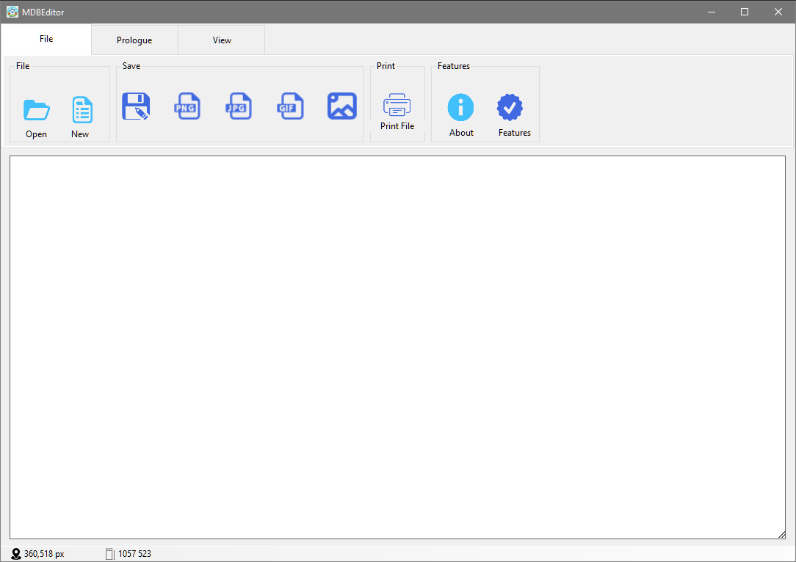
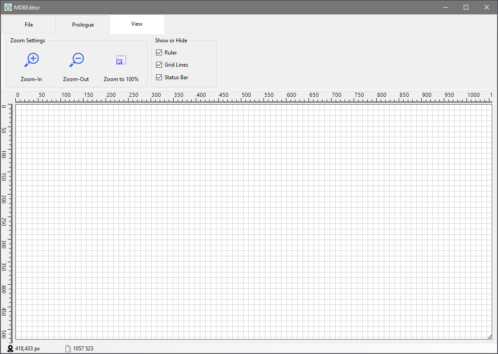

## MDBEditor

MDBEditor, an application with embedded tools that allows users to create images from scratch, 
was developed based on MSPaint and continues to be published as open source for all users to benefit from.

## Features

- :white_check_mark: User can open image, create new image or save as image
- :white_check_mark: Image has been saveable as PNG, JPG, TIFF, GIF, ICO or WMF
- :white_check_mark: Image has been printable as colored or grayscaled
- :white_check_mark: User can draw any shape like square, rectangle, triangle, hexagon, left arrow, plus, trapezoid or circle etc.
- :white_check_mark: User can resize the image as pixel or percentage
- :white_check_mark: Image settings can be inspect as modal page
- :white_check_mark: Image's alignment has been changeable as horizontal or vertical
- :white_check_mark: Image can be zoomable as 4x
- :white_check_mark: User can use gridlines
- :white_check_mark: User can crop as whatever he/she want
- :white_check_mark: User can use tools such as pen, eraser, zoom, filler.
- :wrench: Drawing board cannot be resized with mouse due of image despution
- :x: Application doesnt have beatiful icon yet. 

## Screenshots

Home Page            |  Home Page With Ruler and Grid Lines
:-------------------------:|:-------------------------:
  |  

## Installation

Clone the project

```bash
  git clone git@github.com:AbdullahOztuurkk/MDBEditor.git
```

Go to project folder

```bash
  cd my-project
```

Install dependencies

```bash
  dotnet restore
```
Run the application

```bash
  dotnet run
```

## 🎉 Contributing

Contributions are always welcome!

See [CONTRIBUTING.md](/CONTRIBUTING.md) for ways to get started.

## Tech Stack

This project has been developed with .NET 6 as WinForms Application.

## Feedback

Feedback is appreciated! Reach out on [Twitter](https://twitter.com/AbdullahOztuurk) or submit a new issue!

## License

[MIT](/LICENSE)
